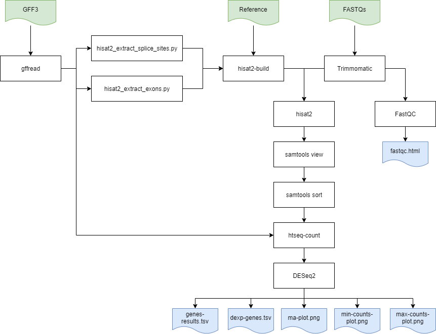
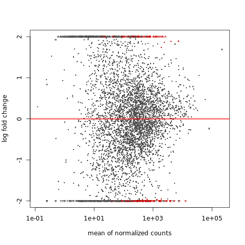
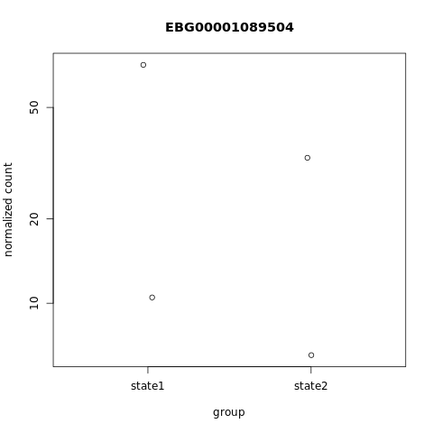

# Differential Gene Expression Analysis.



The final workflow, implemented using [Nextflow](https://www.nextflow.io/), can be found here: [dgexp.nf](https://github.com/noelnamai/dgexp/blob/master/dgexp.nf). The accompanying configuration file is available here: [nexflow.config](https://github.com/noelnamai/dgexp/blob/master/nextflow.config). The **Dockerfile** used to generate the Docker container used in the workflow is available here: [Dockerfile](https://github.com/noelnamai/dgexp/blob/master/docker/Dockerfile).

Most of the tools used are standard of the shelf tools. However, **DESeq2** has been wrapped into an Rscript available here: [dgexp.R](https://github.com/noelnamai/dgexp/blob/master/docker/dgexp.R).

[Nextflow](https://www.nextflow.io/docs/latest/getstarted.html) can be used on any *POSIX* compatible system (Linux, OS X, etc). It requires **Bash 3.2** (or later) and **Java 8** (or later, up to 11) to be installed. It is important to run the workflow on a **Linux** based system with atleast **8 CPUs** and **30 GB of RAM**. This workflow was run and tested on an **m4.2xlarge Amazon Instance**. 

1. Have atleast **Java 8** or later installed. Check if **Java** is installed using the following command:

```
$ java --version
openjdk 11.0.5 2019-10-15
OpenJDK Runtime Environment (build 11.0.5+10-post-Ubuntu-2ubuntu116.04)
OpenJDK 64-Bit Server VM (build 11.0.5+10-post-Ubuntu-2ubuntu116.04, mixed mode, sharing)
```

2. Download the the **nextflow** main executable file using the following command: 

```
$ wget -qO- https://get.nextflow.io | bash

      N E X T F L O W
      version 20.01.0 build 5264
      created 12-02-2020 10:14 UTC (10:14 GMT)
      cite doi:10.1038/nbt.3820
      http://nextflow.io


Nextflow installation completed. Please note:
- the executable file `nextflow` has been created in the folder: /mnt/c/Users/noel.namai/personal/asimov
- you may complete the installation by moving it to a directory in your $PATH
```

3. Move the **nextflow** executable file to a directory accessible by the **$PATH** variable e.g.

```
$ mv nextflow /usr/local/bin/
```

```
$ nextflow -version

      N E X T F L O W
      version 20.01.0 build 5264
      created 12-02-2020 10:14 UTC (10:14 GMT)
      cite doi:10.1038/nbt.3820
      http://nextflow.io
```

4. Install **Docker**. A good walk through is available here: [How To Install and Use Docker on Ubuntu 18.04](https://www.digitalocean.com/community/tutorials/how-to-install-and-use-docker-on-ubuntu-18-04).

```
$ docker --version
Docker version 18.09.6, build 481bc77
```

5. Clone the github repository to your environment:

```
$ git clone https://github.com/noelnamai/dgexp.git
```

6. Set up the *data* directory to have the structure shown below. Both the **ecoli_dh10b_ensembl.fasta** and **ecoli_dh10b_ensembl.gff3** were downloaded from [Ensembl](http://bacteria.ensembl.org/Escherichia_coli_str_k_12_substr_dh10b/Info/Index). The provide **fasta** and **gff3** were not yielding any expression results for all the samples.

```
$ tree dgexp/

├── data
│   ├── ecoli_dh10b_ensembl.fasta
│   ├── ecoli_dh10b_ensembl.gff3
│   ├── ecoli_state1_rep1.fastq.gz
│   ├── ecoli_state1_rep1_2.fastq.gz
│   ├── ecoli_state1_rep2.fastq.gz
│   ├── ecoli_state1_rep2_2.fastq.gz
│   ├── ecoli_state2_rep1.fastq.gz
│   ├── ecoli_state2_rep1_2.fastq.gz
│   ├── ecoli_state2_rep2.fastq.gz
│   ├── ecoli_state2_rep2_2.fastq.gz
│   └── plasmid.fasta
├── dgexp.nf
├── docker
│   ├── Dockerfile
│   └── dgexp.R
├── nextflow.config
└── results
    ├── dexp-genes.tsv
    ├── genes-results.tsv
    ├── ma-plot.png
    ├── max-counts-plot.png
    └── min-counts-plot.png
```

7. To run the workflow, use the following command from the **dgexp** directory:

```
$ nextflow run dgexp.nf

N E X T F L O W  ~  version 20.01.0
Launching `dgexp.nf` [zen_faggin] - revision: b400c70a68

D I F F E R E N T I A L  G E N E  E X P R E S I O N  A N A L Y S I S
====================================================================

Samtools   : 1.9
Gffread    : 0.11.8
HISAT2     : 2.1.0
HTSeq      : 0.11.1
DESeq2     : 1.26.0
Start time : 2020-03-17T20:46:25.890092Z

executor >  local (20)
[9c/e5fe4d] process > convert_gff3_to_gtf    [100%] 1 of 1 ✔
[73/31090f] process > extract_exons_and_ss   [100%] 1 of 1 ✔
[2e/60e3fd] process > build_genome_index     [100%] 1 of 1 ✔
[cc/9b45eb] process > map_reads_to_reference [100%] 4 of 4 ✔
[4c/5111fc] process > convert_sam_to_bam     [100%] 4 of 4 ✔
[3b/633ff5] process > sort_bam_file          [100%] 4 of 4 ✔
[69/959a52] process > generate_raw_counts    [100%] 4 of 4 ✔
[90/3dca4e] process > detect_dexp_genes      [100%] 1 of 1 ✔

Completed at: 17-Mar-2020 21:11:38
Duration    : 25m 12s
CPU hours   : 2.0
Succeeded   : 20
```

8. The following files are the final outputs from the *detect_dexp_genes* process which runs **DESeq2**:

- [dexp-genes.tsv](https://github.com/noelnamai/dgexp/blob/master/results/dexp-genes.tsv)
- [genes-results.tsv](https://github.com/noelnamai/dgexp/blob/master/results/genes-results.tsv)
- [ma-plot.png](https://github.com/noelnamai/dgexp/blob/master/results/ma-plot.png)



- [max-counts-plot.png](https://github.com/noelnamai/dgexp/blob/master/results/max-counts-plot.png)



- [min-counts-plot.png](https://github.com/noelnamai/dgexp/blob/master/results/min-counts-plot.png)


